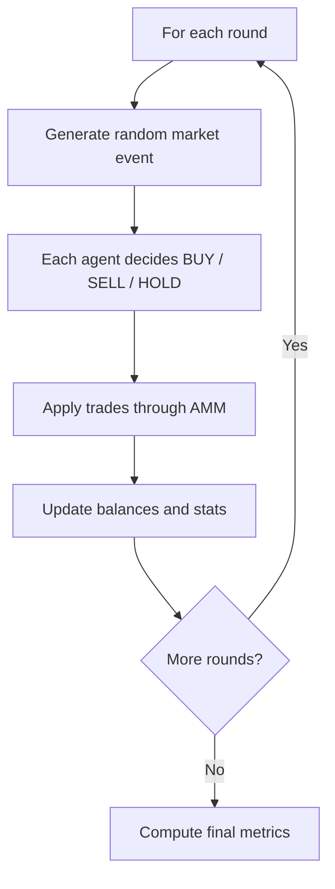

# Memecoin Agent Trading Simulation

## What's the goal?

This simulation is for testing how a crowd of different trader personalities behaves over time in a memecoin market. Some key questions to ask:
- What happens to price when many agents (traders) react to hype/fear headlines?
- Which personas perform better in different market scenarios?
- Does the market become stable, choppy, or boom-bust over many rounds?

## Core idea

- `AGENTS` = population size (how many traders exist in the market).
- `ROUNDS` = time steps (how many market turns happen).

That means, each round is one market cycle:
1. A market event/headline is generated.
2. Every agent makes one decision (`BUY`, `SELL`, or `HOLD`).
3. Trades are executed through the AMM (Automated Market Maker).
4. Balances, PnL, and price update.
5. Next round starts with the updated market state.

Example:
- `AGENTS=50`, `ROUNDS=10` means 50 traders acting once per round for 10 rounds.
- Max action decisions = `50 * 10 = 500`.

By default in quick start (see below):
- 1000 agents, 200 rounds, seed=42, SCENARIO=balanced.

## How to run the simulation?

### Quick Start
```bash
# set your key in main.py (GEMINI_API_KEY)

# sync your env
uv sync

# run
uv run python3 main.py
```

## Files / Project layout:
- `main.py` - runtime loop, Gemini calls, prompt parsing, execution, reporting
- `constants.py` - personas, scenarios, default config values (this is where you can tweak your agent/trader personas)
- `amm.py` - we keep things simple with constant-product AMM (`pool_new`, `pool_price`, `pool_buy`, `pool_sell`)

## Memecoin trader personas...
| Persona | Rough behavior |
|--------|------------------|
| `Degen` | Buys hard on hype, panic-sells on fear, can still hold |
| `Sniper` | Buys momentum, quick TP/SL, holds when no edge |
| `Paper_hands` | Panic-sells bad news, FOMOs bullish news, may freeze on neutral |
| `Stonks` | Smaller position sizes, more likely to hold in unclear tape |
| `Flipper` | Fast in/out, but may hold in choppy neutral rounds |
| `Diamond` | Buys dips/hype, mostly holds, sells only on severe fear |

## Scenarios (persona mix + event-type weights)
- **`balanced`** - mixed hype/fear headlines
- **`hype_season`** - mostly bullish headlines and momentum
- **`fear_pit`** - mostly bearish headlines and panic

If you now understand how the simulation works, you can run it with custom parameters:
```bash
# Different "market weather" + persona mix
SCENARIO=hype_season AGENTS=1000 ROUNDS=100 python3 main.py

# Custom persona weights (refer to persona tables)
PERSONAS="Degen=0.5,Sniper=0.2,Paper_hands=0.15,Stonks=0.1,Flipper=0.05,Diamond=0.0" SCENARIO=fear_pit python3 main.py

SAVE_PATH="results.json" LOG_EVERY=1 python3 main.py
```

## Simulation flowchart
Decisions are not hardcoded in the round loop. Every agent asks Gemini for `BUY` / `SELL` / `HOLD` each round.



Defaults: `1000` agents, `200` rounds, `seed=42`, `SCENARIO=balanced`.

## Output details (`results.json`)

- `agents` is the main agent-centric section.
- Each agent object contains:
- `agent_id`, `persona`
- `action_counts` (executed BUY/SELL/HOLD totals)
- `final` snapshot (`usdc_balance`, `token_balance`, `avg_entry_price`, `value_usdc`, `pnl_usdc`)
- `rounds` history with one entry per round:
- `requested_action`, `requested_amount`
- `executed_action`, `executed_usdc`, `executed_token`
- `usdc_balance`, `token_balance`, `avg_entry_price`, `value_usdc`, `pnl_usdc`
- Top-level aggregates are still included (`pnl_total_usdc`, `action_counts`, `action_counts_by_persona`, `persona_stats`, distribution stats).

This structure is optimized for per-agent behavior segregation and round-by-round PnL tracking.

## Parallelism

Model calls are executed in parallel each round using `asyncio.gather(...)` with concurrency bounded by `MAX_CONCURRENT`.

## Events

Types used in the simulation include memecoin-native events:
`KOL_TRENDING`, `CT_X_NEWS_BULL`, `CT_X_NEWS_BEAR`, `TG_CALLS_PUMP`, `TG_PANIC_SELL`, `VIRAL_MEME`, `WHALE_EXIT`, `PRICE_SURGE`, `FUD`, `DUMP`, `SIDEWAYS`.

Each round also has a memecoin headline sampled from the selected scenario (CT/X + Telegram style), and agents decide `BUY` / `SELL` / `HOLD` via API response.