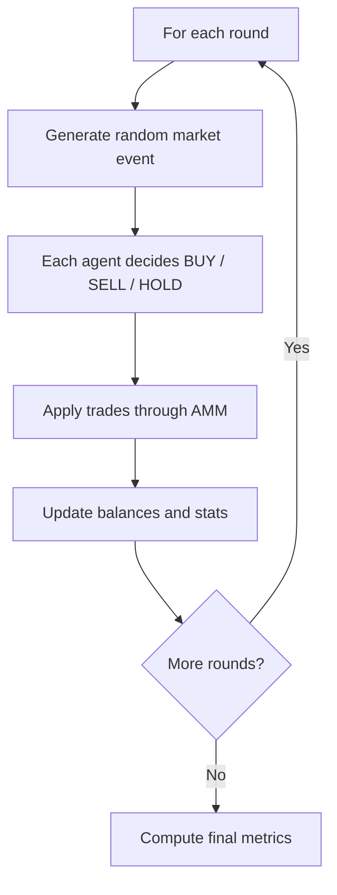

# Memecoin Agent Trading Simulation

## How does this simulation work? 


## Quick Start

```bash
# key is set directly in main.py (change it there if needed)

# run
python3 main.py
```

## Files / Project layout:
- `main.py` - runtime loop, Gemini calls, prompt parsing, execution, reporting
- `constants.py` - personas, scenarios, default config values
- `amm.py` - constant-product AMM math (`pool_new`, `pool_price`, `pool_buy`, `pool_sell`)

## Personas
| Persona | Rough behavior |
|--------|------------------|
| `Degen` | Buys hard on hype, panic-sells on fear, can still hold |
| `Sniper` | Buys momentum, quick TP/SL, holds when no edge |
| `Paper_hands` | Panic-sells bad news, FOMOs bullish news, may freeze on neutral |
| `Stonks` | Smaller position sizes, more likely to hold in unclear tape |
| `Flipper` | Fast in/out, but may hold in choppy neutral rounds |
| `Diamond` | Buys dips/hype, mostly holds, sells only on severe fear |

## Scenarios (persona mix + event-type weights)

- **`balanced`** - mixed hype/fear headlines
- **`hype_season`** - mostly bullish headlines and momentum
- **`fear_pit`** - mostly bearish headlines and panic

Pick with `SCENARIO=...`. Override persona counts with `PERSONAS=...` if you want a custom mix (event weights still follow `SCENARIO`).

Decisions are not hardcoded in the round loop. Every agent asks Gemini for `BUY` / `SELL` / `HOLD` each round.

## Simulation flowchart



Defaults: `1000` agents, `200` rounds, `seed=42`, `SCENARIO=balanced`.

```bash
# Different "market weather" + persona mix
SCENARIO=hype_season AGENTS=1000 ROUNDS=100 python3 "agent_memecoin_trading_simulation/main.py"

# Custom persona weights (names must match table above)
PERSONAS="Degen=0.5,Sniper=0.2,Paper_hands=0.15,Stonks=0.1,Flipper=0.05,Diamond=0.0" SCENARIO=fear_pit python3 "agent_memecoin_trading_simulation/main.py"

SAVE_PATH="results.json" SAVE_AGENTS=1 python3 "agent_memecoin_trading_simulation/main.py"
```

Env vars: `AGENTS`, `ROUNDS`, `SEED`, `SCENARIO`, `PERSONAS`, `INITIAL_AGENT_USDC`, `POOL_USDC`, `POOL_TOKENS`, `FEE_BPS`, `SAVE_PATH`, `SAVE_AGENTS`, `LOG_EVERY`, `GEMINI_MODEL`, `MAX_CONCURRENT`, `API_RETRIES`, `API_TIMEOUT_S`.

## Events

Types used in the simulation include memecoin-native events:
`KOL_TRENDING`, `CT_X_NEWS_BULL`, `CT_X_NEWS_BEAR`, `TG_CALLS_PUMP`, `TG_PANIC_SELL`, `VIRAL_MEME`, `WHALE_EXIT`, `PRICE_SURGE`, `FUD`, `DUMP`, `SIDEWAYS`.

Each round also has a memecoin headline sampled from the selected scenario (CT/X + Telegram style), and agents decide `BUY` / `SELL` / `HOLD` via API response.